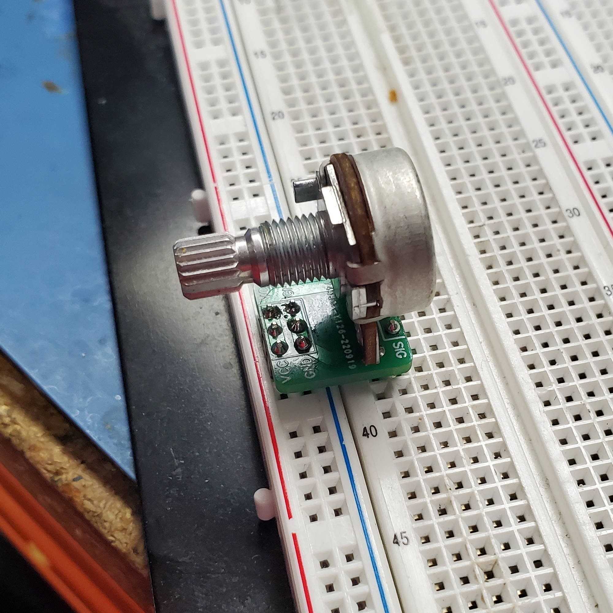
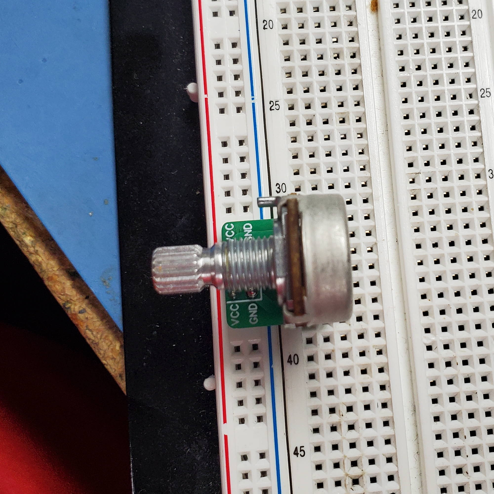
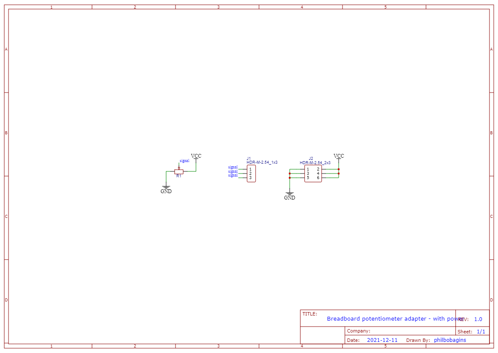

Breadboard potentiometer adapter (with power)
=============================================

A tiny little board to make it easier to plug a potentiometer into a breadboard.

This version of the board is meant to sit across the power rails of the breadboard, connecting power and ground to each side of the potentiometer and leaving the potentiometer's wiper connected to the pins labelled "SIG".

See also: https://github.com/PhilboBaggins/breadboard-potentiometer-adapter

Licence
-------

Copyright © 2022 Phil Baldwin

This work is licensed under a Creative Commons Attribution-ShareAlike 4.0 International License.

You should have received a copy of the license along with this work. If not, see <http://creativecommons.org/licenses/by-sa/4.0/>.
